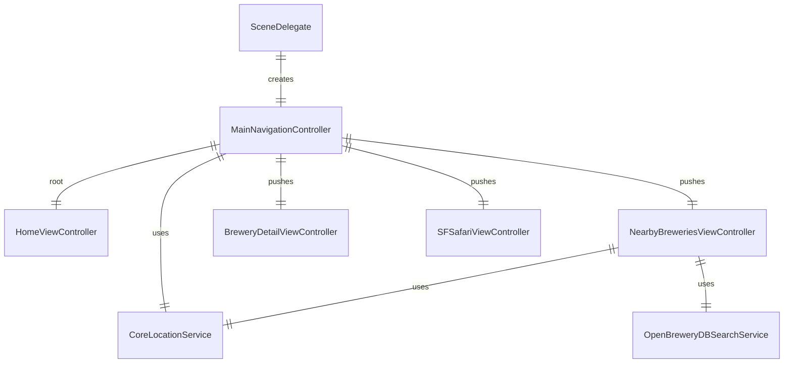

# Brewery Finder

Brewery Finder is an app that allows a user to locate nearby breweries to visit. It uses the [Open Brewery DB](https://www.openbrewerydb.org) along with iOS's Core Location framework to find breweries near the device where the app is running.

Upon opening the app, the user is presented with a simple home screen with a button to locate nearby breweries. When the button is tapped, the app requests the user's location, and transitions to a screen that shows a list of nearby breweries, along with a map that shows pins where the breweries are located.

If the user taps on a brewery in the list, they are presented with a detail view that shows additional detail about the brewery, such as address, phone number and web site. They are also able to call the brewery by tapping on the phone number or visit the web site by tapping on it.

## Architecture
The app is implemented with a simple MVVM architecture. It uses something similar to the [Coordinator pattern](https://khanlou.com/2015/01/the-coordinator/) to manage navigation between different view controllers. The coordinator is implemented as a `UINavigationController` subclass. Using a view controller to manage UI flow is inspired by this post by Dave DeLong:

https://davedelong.com/blog/2017/11/06/a-better-mvc-part-2-fixing-encapsulation/

Generally, view controllers each define a delegate protocol to communicate back with the `MainNavigationController`. The `MainNavigationController` implements each delegate as an extension, and when activity occurs in the child view controllers, the `MainNavigationController` decides what to do next.

View models use a mix of plain properties and Combine `Publisher`s. Combine is used when data needs to be updated dynamically while the view controller is on screen (e.g. on the `NearbyBreweriesViewController`, when the search results come back).

In addition to the above, integration with the API and location services are implemented as Service classes, with protocols to abstract away some of the integrations and allow for use of test doubles.

The UI is implemented with UIKit, but the views are all written programmatically. SwiftUI previews are used to preview the views for quick visual feedback. The SwiftUI/UIKit preview integration is inspired by this post:

https://nshipster.com/swiftui-previews/

### Components
The `MainNavigationController` is created by the `SceneDelegate` and added to the key window. The `MainNavigationController` manages creation and display of the other view controllers. View controllers use services as needed.

## Testing
When building the app, one of the goals was to push as much logic as possible into view models, so that it is less coupled to UIKit. With that in mind, test coverage on the view models was the highest priority. When the view models depend on services, they were generally replaced with test doubles. Test doubles generally follow the naming convention outlined here, using mostly spies or stubs in this app:

https://martinfowler.com/bliki/TestDouble.html

For naming the tests, this convention was generally adhered to, where the name reflects what is being tested, a description of the context, and expected result:

https://qualitycoding.org/unit-test-naming/

Beyond the view models, the `MainNavigationController` is also an important piece of logic, so it has test coverage. Testing the `MainNavigationController` was a little more difficult from the view models, since it integrates heavily with UIKit. In the tests, we use a `SpyMainNavigationController` which intercepts methods to push/present view controllers, so they can be validated in tests.
